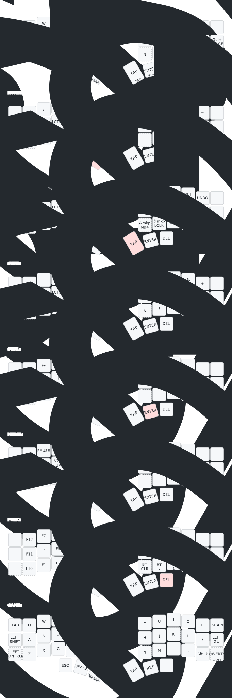

# ZMK Config

Use https://nickcoutsos.github.io/keymap-editor/ to edit.

See [Actions output](https://github.com/issmirnov/zmk-config/actions) for firmware downloads.

## Rendered Keymap

(using https://github.com/caksoylar/keymap-drawer)

